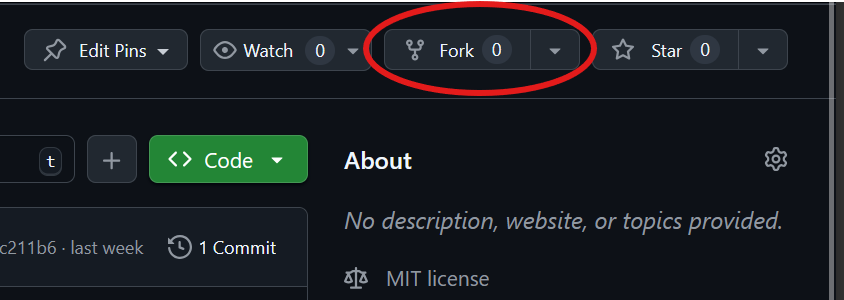
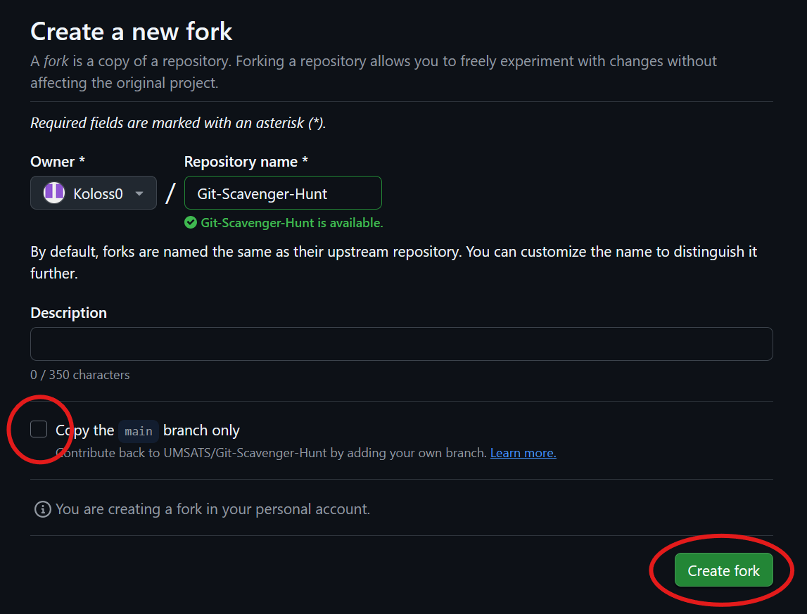
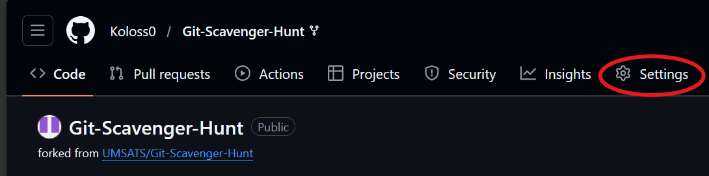
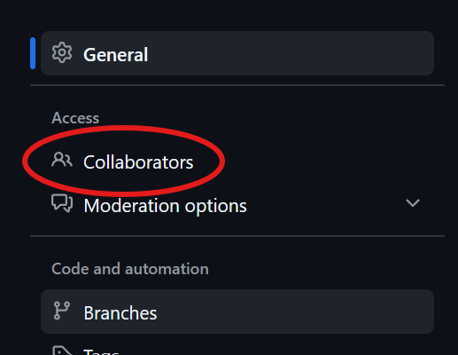
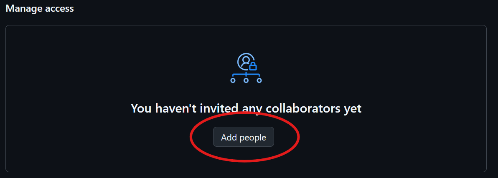
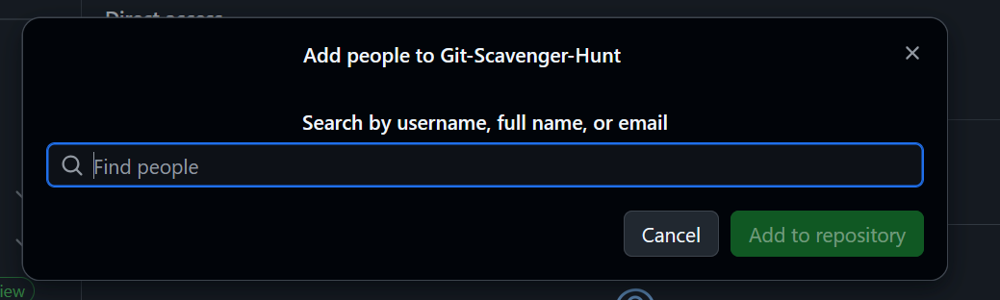
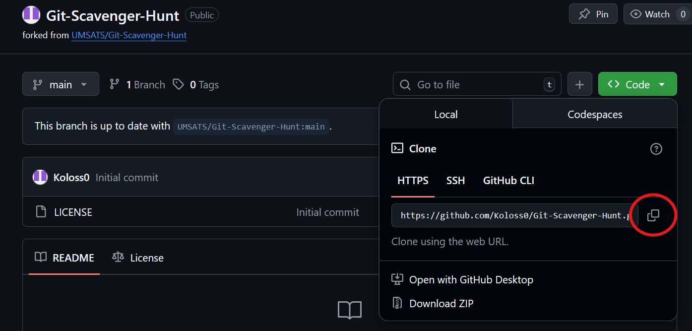

# Git Scavenger Hunt

Welcome to the official *Git For Noobs!* scavenger hunt. This README file contains all the instructions you need to get started!

## 1. Prerequisites

**You will need:**

- Git
- A GitHub account
- A fork of this repository

## 1.1 Install Git

Make sure all your team members have Git installed.

**Download Git:** https://git-scm.com/install/windows

Now you'll need to enter these **REQUIRED configurations** into your terminal:

```
git configure --global user.name "YOUR NAME"
git configure --global user.email "YOUR EMAIL"
```

These are some **RECOMMENDED configurations** that will make things work just a bit better:

```
git config --global init.defaultBranch main
git config --global core.editor "nano -w"
```

## 1.2 Create a GitHub Account

Go to [GitHub.com](https://github.com/) and click **Sign Up**. You can use any email you want, as long as it's the same as what you configured Git with.

## 1.3 Fork the Repository

1. Scroll to the top of the page and hit the **Fork** button:



2. On the next page, make sure to *uncheck* the "Copy to the `main` branch only" checkbox, and hit **Create Fork**:



You now have a personal copy of this repository on your GitHut account. Now it's time to add your group members!

3. Go to **Settings**:



4. Find **Collaborators** in the sidebar:



5. Click **Add People**:



6. Search for your group members and add them:



Make sure your members accept the invite from their emails.

## 1.4 Clone the Forked Repository

1. Copy the URL from the **Code** dropdown:



2. Now clone the repo:

```
git clone URL GOES HERE
```

If you tried to clone the repository and it asks you for a password, **you may need to install [Git Credential Manager](https://github.com/git-ecosystem/git-credential-manager/tree/main)** to proceed. But this should only happen if you're on Linux or macOS.

## 2. The Scavenger Hunt

Okay, with setup out of the way you can finally get started scavenger hunting! 😀🎉

Your team has been assigned a mandate of maintaining a long forgotten project which used to run your company's super high-tech computer network.

But the maintainers have gone missing and it's up to you to get it back to its former working glory!

Lucky for you, you've been sent some helpful instructions on how to get started:

```
Dear new maintainers,

This project is riddled with bugs and unnecessary branches. There's a to-do list in the main code file and instructions on how to organize your team in CONTRIBUTING.md. You may find those useful.

Thanks and good luck,
[Inked out name]

PS. You may need to install Python
```

...Well, that was sort of helpful. Anyways, good luck!

## 3. Running

(To-do)